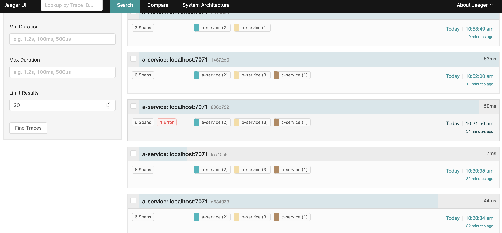

# Express-Jaeger

**Jaeger middleware to request tracing for express application**

## Required Reading Opentracing 
To fully understand Opentracing, it's helpful to be familiar with the [OpenTracing project](http://opentracing.io) and
[terminology](http://opentracing.io/documentation/pages/spec.html) more specifically.
## Required Reading Jaeger 
To fully understand Jaeger, it's helpful to be familiar with the [Jaeger project](https://www.jaegertracing.io) and [Jaeger Client for Node](https://www.npmjs.com/package/jaeger-client)

## Installation

```
npm i @chankamlam/express-jaeger -S
```

## Architecture of Jaeger Server
for development

for prodution


## Build up Jaeger Server Infra locally(development env)
```
docker run -d -e COLLECTOR_ZIPKIN_HTTP_PORT=9411 -p5775:5775/udp -p6831:6831/udp -p6832:6832/udp \
  -p5778:5778 -p16686:16686 -p14268:14268 -p9411:9411 jaegertracing/all-in-one:latest
```


## Usage
```
const express = require("express");
const jaeger = require("@chankamlam/express-jaeger")
const app = express();

// setup config, atleast need this param
const config = {
    serviceName: 'aservice-express',                              // your service name
    sampler: {                                                    // setup sampler
        type: "const",
        param: 1
    },
    reporter: {
        collectorEndpoint: "http://localhost:14268/api/traces"    // your jaeger server endpoint
    },
};

// setup options, defaut is {}
const options = { baggagePrefix: "-Johua-" };

// using jager,after this it will has three objects(span,tracer,request)binding in req
app.use(jaeger(config,options));

app.get("/normalUsingSpan2Log", async function (req, res) {
    const span = req.span;
    span.log({event: "timestamp", value: Date.now()});
    span.finish();
    res.send({code: 200, msg: "success"});
});

app.get("/errorUsingSpan2Log", async function (req, res) {
    const span = req.span;
    try {
      throw Error("err");           // create exception to test
    } catch (err) {
      span.setTag("error", true);   // diaplay to JaegerUI when you mark tag as "error"
      span.log({
        level: "error",
        message: err.message
      });
    }
    span.finish();
    res.send({code: 200, msg: "success"});
});

app.get("/remoteCallingAndlogResult", async function (req, res) {
    const span = req.span;
    const result = await req.request("http://localhost:3001/bc", {
        tracer: req.tracer,
        rootSpan: req.span
      });
    span.logEvent("result",result)
    span.finish();
    res.send({code: 200, msg: "success"});
});


app.listen(3000, '127.0.0.1', function () {
    console.log('start server...');
});

```
## Lookup Request Tracing
open http://localhost:16686



## Config
for what is usage of the param, pls look up to "jaeger-client"
```
{
  serviceName: "string",           // required
  disable: "boolean",
  sampler: {
    type: "string",                // required
    param: "number",               // required
    hostPort: "string",
    host: "string",
    port: "number",
    refreshIntervalMs: "number"
  },
  reporter: {
    logSpans: "boolean",
    agentHost: "string",
    agentPort: "number",
    collectorEndpoint: "string",   // required
    username: "string",
    password: "string",
    flushIntervalMs: "number"
  },
  throttler: {
    host: "string",
    port: "number",
    refreshIntervalMs: "number"
  }
}
```

## options
for what is usage of the param, pls look up to "jaeger-client"
```
{
    contextKey: "string",
    baggagePrefix: "string",
    metrics: "object", // a metrics
    logger: "object",  // a logger
    tags: "object",    // set of key-value pairs which will be set as process-level tags on the Tracer itself.
    traceId128bit: "boolean",
    shareRpcSpan: "boolean",
    debugThrottler: "boolean",
}
```